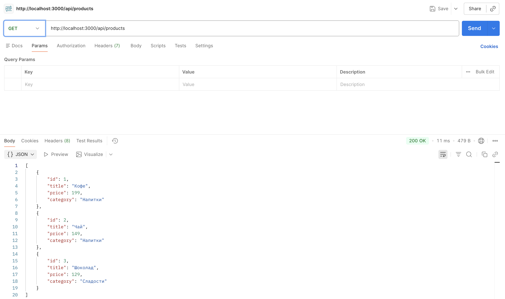
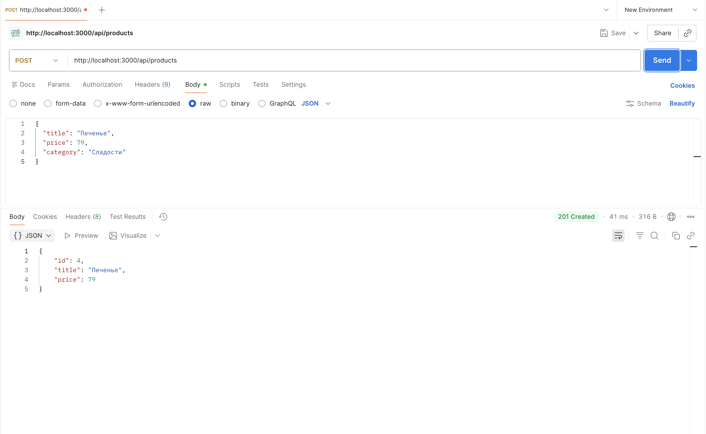
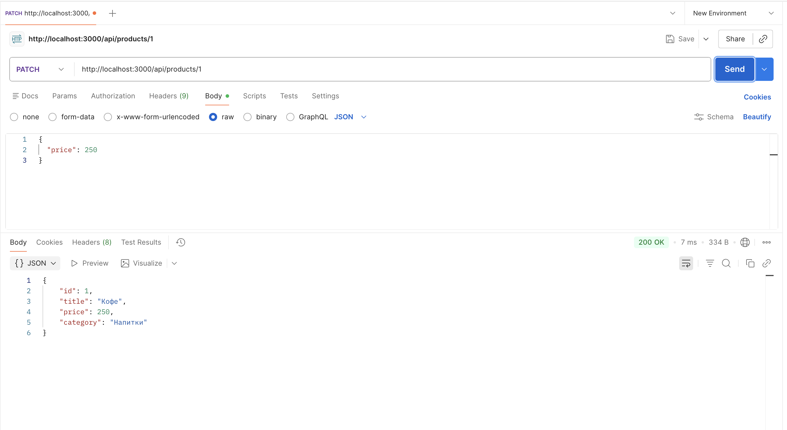
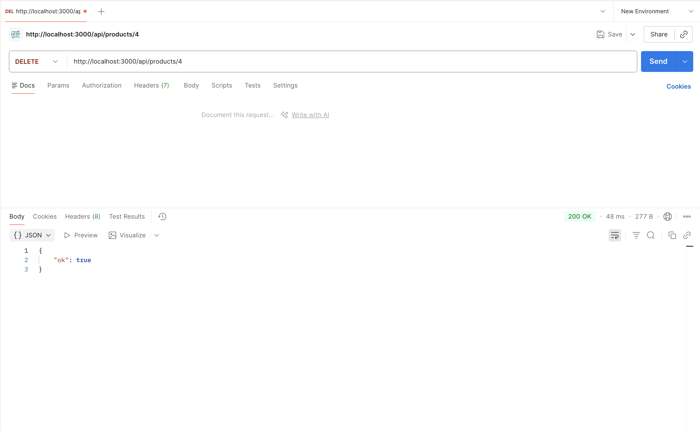
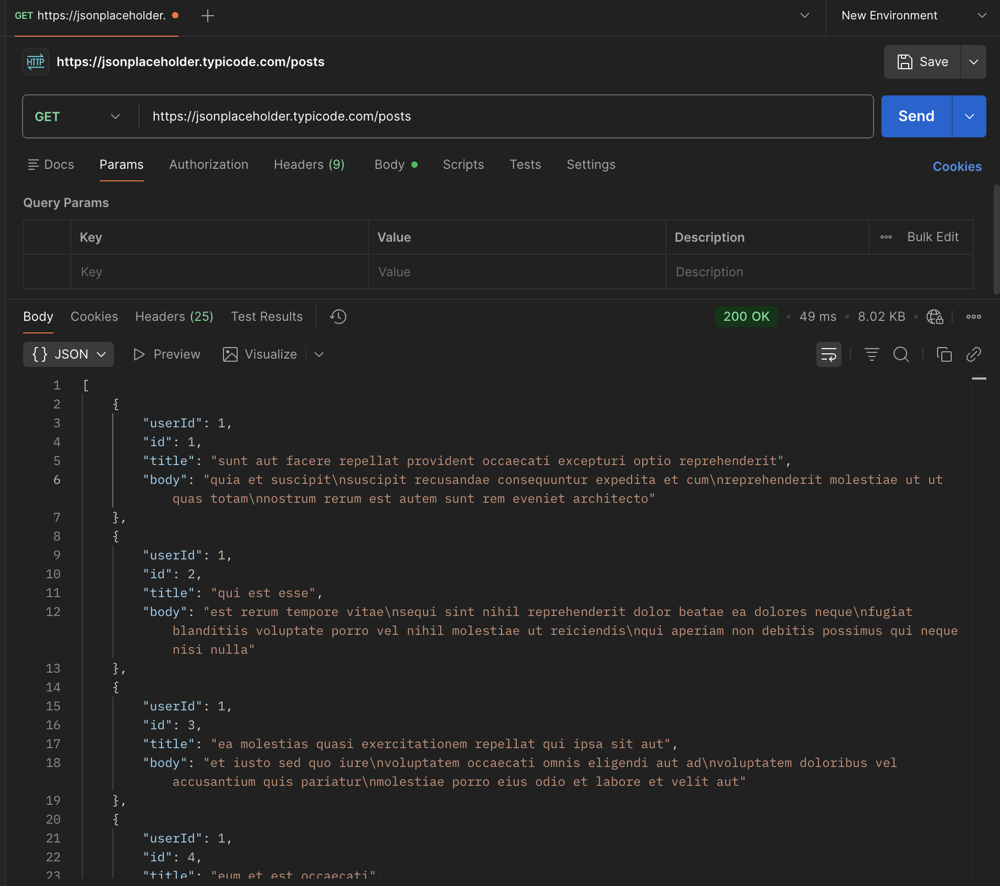
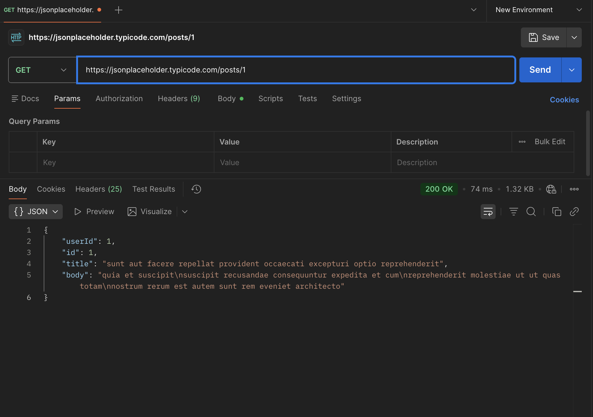
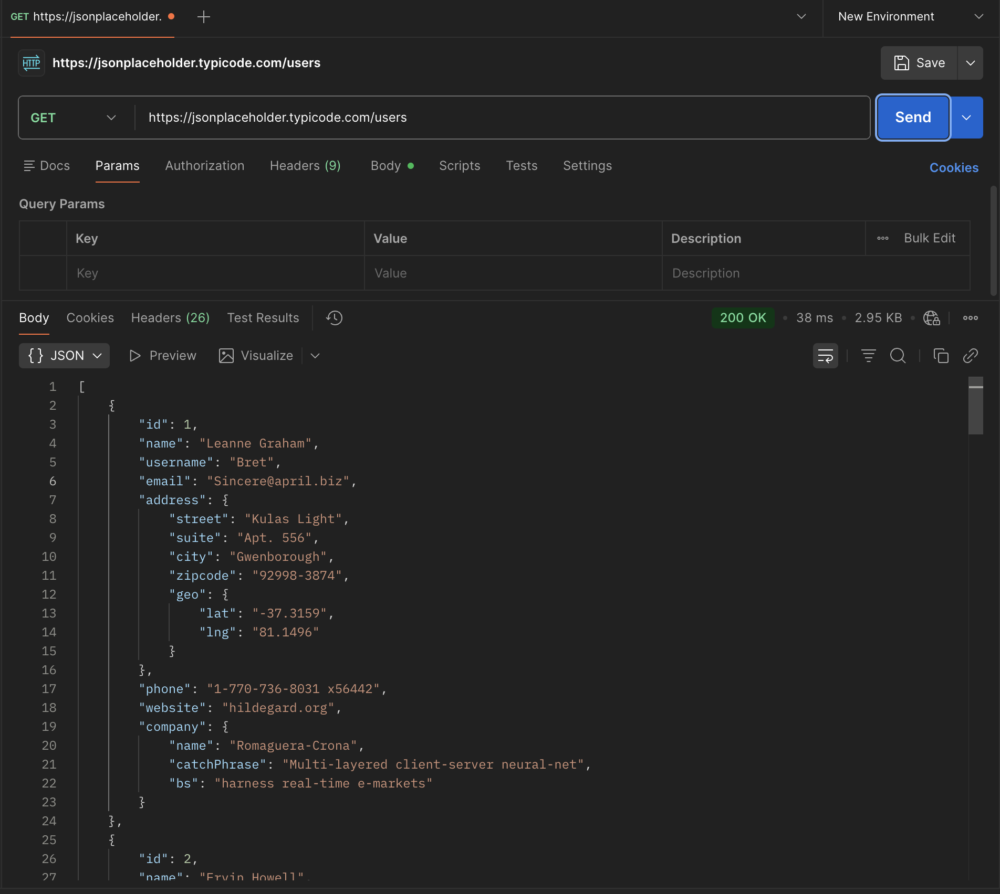
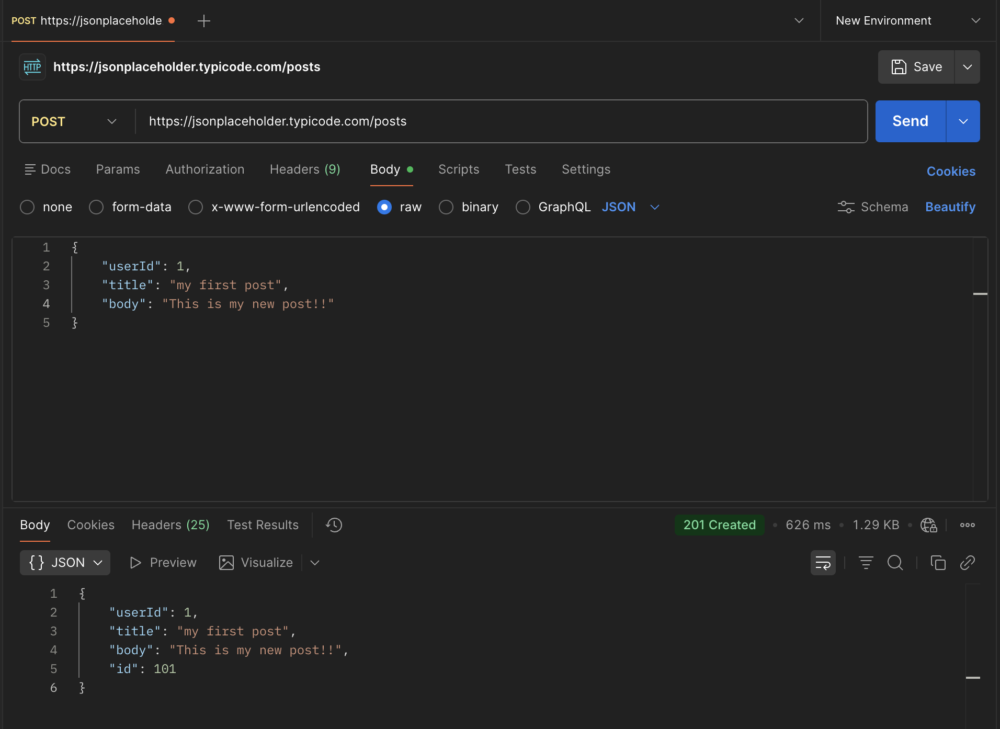
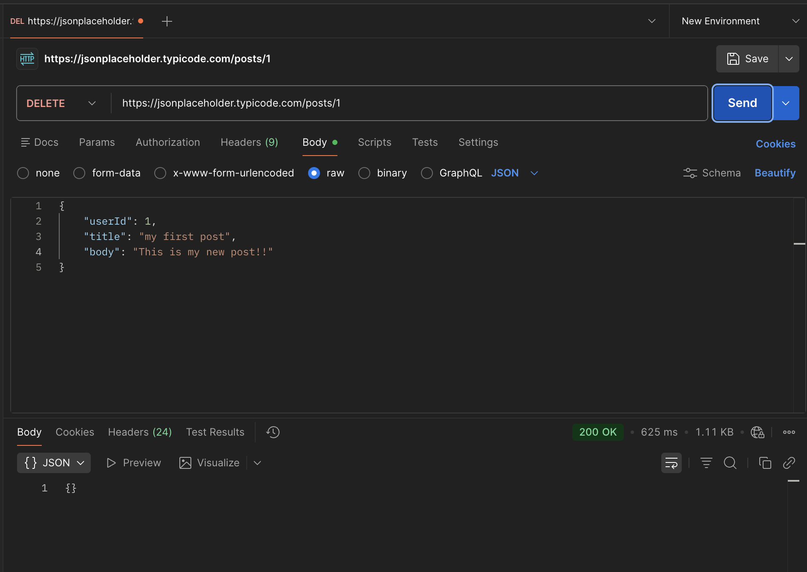

# Практические работы по фронтенд и бэкенд разработке

## Практика 1: CSS-препроцессоры (SASS)
Карточка товара для виниловой пластинки The Beatles с использованием:
- Переменные ($color-primary, $color-accent, $font-heading)
- Миксин (@mixin button)
- Вложенность селекторов
- Дополнительный элемент (бейдж "Limited Edition")

## Практика 2: Node.js + Express API
CRUD API для товаров с дополнительным полем "category":
- GET /api/products — список товаров
- GET /api/products/:id — один товар
- POST /api/products — создание товара
- PATCH /api/products/:id — обновление товара
- DELETE /api/products/:id — удаление товара
<<<<<<< HEAD

**Скриншоты:**
- 
- 
- 
- 
- 

## Практика 3: JSON и внешние API

### Тестирование своего API (из Практики 2)
Скриншоты запросов к своему API находятся выше (Практика 2).

### Работа с внешним API (JSONPlaceholder)
Выполнено 5 запросов:
- GET /posts — 
- GET /posts/1 — 
- GET /users — 
- POST /posts — 
- DELETE /posts/1 — 

## Практика 4: API + React (Интернет-магазин)
- **Бэкенд:** `/backend` — Express API с товарами (минимум 10 товаров с полями: название, категория, описание, цена, наличие на складе)
- **Фронтенд:** `/frontend` — React приложение, подключенное к API
- Реализован полный CRUD через интерфейс

### Запуск проекта
**Бэкенд:**
```bash
cd backend
npm install
npm run dev
=======
- Дополнительное поле: category
>>>>>>> origin/main
